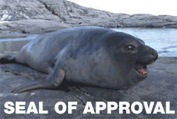

> _Your thesis is like your first love: it will be difficult to forget. In the end, it will represent your first serious and rigorous academic work, and this is no small thing._
> \- U. Eco

# A Thesis in theoretical physics

You visited an advisor and got a topic to work on in theoretical physics, congratulations! Now the only thing you are left to do is study, do the research, wrap it up and write it down. As for the [_Tools of the trade_](../work_tools/) article, this list has a down-to-earth approach on providing a pragmatical list of tools and advice on writing your thesis. As in other articles I will be as general as possible and has specific as needed, describing my suggestions for doing a thesis in general -> in physics -> theoretical physics -> theoretical nuclear physics -> and my Lund group in particular. Both at undergraduate, graduate and PhD level.

There are entire libraries, websites, and initiatives dedicated to the craft of writing in general, and academic writing in particular. Nice initiatives on general writing and tools are [shut up and write](https://shutupwrite.com/), [Hemingway App](http://www.hemingwayapp.com/).
On academic writing there is also plenty of material to take inspiration. Most interestingly, there is a whole 300-pager by Umberto Eco "How to write a thesis" ([here](https://thereader.mitpress.mit.edu/umberto-eco-how-to-a-write-thesis/) you can read the review and excerpt). Online you can find the book if you wish but don't waste precious thesis time (this post is already long more than enough). Keep in mind that Eco's book was written in the Italian humanities context where a thesis lasts easily more than a year, therefore is more applicable to a PhD's than an undergraduate's thesis. Lund University (LU from now on) has its own resources on academic writing, there are courses, workshop and an [interesting website](https://awelu.srv.lu.se).

Also in this case learning to have a strong academic writing is a lifelong endavour and it is not possible to master every process at any stage of your studies. But progressively you will become better and more confident on your writing.

- [A Thesis in theoretical physics](#a-thesis-in-theoretical-physics)
  - [Context](#context)
  - [Reading](#reading)
    - [Bibliographic Research](#bibliographic-research)
    - [Textbook, journals and articles](#textbook-journals-and-articles)
    - [Bibliographic Tools](#bibliographic-tools)
  - [Working](#working)
    - [Programming](#programming)
  - [Writing](#writing)
    - [Scope, Tone, Language](#scope-tone-language)
    - [Constrains](#constrains)
    - [Structure](#structure)
    - [Tools](#tools)
  - [Presenting](#presenting)
  - [Following up](#following-up)

## Context

The thesis is the final academic document testifying some work required for the attainment of a degree. There are theses for bachelor, master students, licenciate, and PhD degrees. Even for some professional or professor habilitation in some countries and circumstances. Therefore, even though topics, length and depth might differ from thesis to thesis, they have the same primary audiences: the people handing out the degree. In LU the B.Sc. and M.Sc. graduation theses are refereed by one or two external examiners. In my case they are usually people in mathematical physics, that have experience in many-body systems but not necessary in your method of choice or nuclear physics.

When writing anything, the first thing to keep in mind is the reader. Like your examiners, other people that might read your thesis are knowledgeble of the field, but not of the argument. For example in our case, they will be physicists but not nuclear or theoretical physicists. You can give for granted that they know what is a Lorentz transformation or quantum state, but you should not abuse field-specific jargon and use it without introduction. Every acronym, method and code must be introduced and referred to with references.

The use of references has to be strategic. Being the thesis an official document for attainment of degree, it has to "stand on its own feet". The reader from your target audience has to be able to read comfortably without need of referring to the literature too much. Of course you need to use of the literature, and provide plenty of examples and material to study in more depth. However, within reason everything you use for your results needs to be introduced explicitly so that the content and context of your work is clear.

The work done for a thesis in physics is usually a work centered in research, either by critically reviewing previous research results or by developing original research guided by the supervisor. Bachelor and Master theses are 15, 30, or 60 credits, corresponding to 10, 20 or 40 weeks of full time work respectively. The goals are usually set by the supervisor, and the amout of supervision and independence will dependend on the specific project and adjusted according to performance.

Last and probably least, another consequence of being an official document it is that the thesis has often to adhere to some official or unofficial guidelines. Usually concerning length, structure, format and rarely content. For Lund physics department, you can find the guidelines [here](http://www.fysik.lu.se/fileadmin/fysik/UDIF/Examensarbete/short_form_bullets.pdf) and [here](http://www.fysik.lu.se/fileadmin/fysik/UDIF/Examensarbete/Appendix_A.pdf). [Here](http://www.fysik.lu.se/index.php?id=136959) are the registration checklist for Physics diploma works in LU. Pay particular attention to the learning outcomes.

## Reading

### Bibliographic Research

The first thing when approaching thesis work, is to understand the scientific background and context to your work. This is done by reading articles and books suggested by the supervisor that are instrumental to the problem. Some articles are worth to read and understand in detail, others to skim to grasp the main concepts and results. Only experience can judge how much to devote to each article and how to read and understand effectively. Its not an exact science but an art that improves with experience.

Your thesis work is the opportunity to delve into the literature and start to gain this experience, picking the brain and experience of an expert supervisor, so make the most of it. Try to read academic literature everyday. Read everything that you think is worth to cite and everything you will cite in your work. Read modern developments on journals and the [arXiv](http://arxiv.org) of your field. It is not uncommon for a thesis work to review dozens and even few hundreds articles. The articles your supervisor cite you is only the starting point of a journey of understanding.

In the writing of your thesis, especially in the [introduction](#introduction) you will need to refer to the literature, in order to point the reader providing context and pointers to concept and tools you used in your work. In the same way, scientists use references in articles, and often in books. Therefore you can use the bibliography of the article you read as an important tool for your bibliographic research. You can follow citations in two ways:

- upstream, looking at an article references to understand on which other works is based,
- and downstream, looking at works that cited the said articles and use it for follow-up works.

This is important to understand the scientific foundation and impact of a work.

At LU a short training course is given in [Language and Library](http://www.fysik.lu.se/english/education/for-students/diploma-work/language-course-and-library-training/).

### Textbook, journals and articles

There are different outlets of scientific publications. Textbooks are published by a publisher. Articles of different type get published by a journal. Topical journals are the traditional and always good way to read and update about new results in a field. The editorial collocation of an article is an indication about subject, novelty, and median impact of a publication.
Unofficially and crudely they can be cathegorized in the following way.

- Textbooks: you encountered textbooks in your basic education. Academic textbooks are sometimes more advanced but they are written to be a comprehensive, reliable, organized, and pedagogically useful treatment of an argument. There are few updated books in nuclear physics, in the later years the community is relying more and more on articles.
- Review papers: they are long overview of an argument published in a journal. More updated, limited and cutting-edge than a book, may contain new results. They are a good starting point to work on an argument, especially if books are not available. Journals publishing reviews are e.g. [Review on Modern Physics](https://journals.aps.org/rmp/) and [Reports on progress in physics](https://iopscience.iop.org/journal/0034-4885)
- Articles: these are the "standard" scientific publications, describing new results in as much detail as needed. It is good practice to periodically read issues of the journal publishing articles in the field you want to be updated. For physics a good resources are the [APS journals](https://journals.aps.org/), in particular [Physical Review C](https://journals.aps.org/prc/) (shortened PRC) for nuclear physics and [Physical Review E](https://journals.aps.org/pre/) for many-body systems and non-linear phenomena. In these journals, some particularly interesting articles get featured on the homepage as editorial suggestions.
- Letters: these are short articles, to communicate particularly novel results and timely results that the community should take quick notice. For this reason, on average letters have higher impact and the selection is often stricter. Topical journals like [PRC](https://journals.aps.org/prc/) have "rapid communication" sections for letters. Letters are often targeted to a the wider public of physicists and even scientists. Being featured in [Physical Review Letters](https://journals.aps.org/prl/) (shortened PRL), [Nature](https://www.nature.com/) and [Science](https://www.sciencemag.org/) is an achievement for any physicist.

### Bibliographic Tools

To organize the work of the bibliographic research and citation, apart from the very important brain and internet, sometimes is useful to be helped by tools:

- [Zotero](https://www.zotero.org/) to organize your article library.
- [Scholar](https://scholar.google.com) and [web of science](https://apps.webofknowledge.com/) to find scientists, topics, articles and track citations.

Sometimes people use Mendeley, but I don't feel endorsing bibliographic options owned by editorial companies.

## Working

[Easy work](./matrix.gif)

This will probably be your first experience in original scientific work. Arguably, your objectives shoud be:

1. to learn as much as possible.
2. to do a good research job, that feeds into the primary objective.
3. to present it properly, that's part of the learning outcomes for the diploma work.
4. to think about the role of science in business, society and in your future.

Here is the list of learning outcomes for the diploma work of [B.Sc.](http://www.fysik.lu.se/fileadmin/fysik/UDIF/checklist_learning_outcomes_Bachelor.pdf) and [M.Sc.](http://www.fysik.lu.se/fileadmin/fysik/UDIF/checklist_learning_outcomes_Master.pdf). These are no small technicality but set the expectation of the quality of your work required by not only LU, but the ministry of research and education. Be mindful of the responsability that the title you are applying for carries.

To organize the work according to these requirement, you have to coordinate with your supervisor. Set a timeline and schedule. Keep in mind that the most open and available of the supervisors is probabily a busy person, and has other duties to attend to and frequent trips. Be sure that he is available for any strict bureaucratic or work request you have from your project.

The time management is your responsability and to be open about duties and request you have is an important part of efficient project management and hence successfull work. Check the deadlines and appointments. According to the type of work and credits you have for the project (1 credit are 25-30 hours of work), the work load will be set accordingly and the supervisor will help you set realistic goals.

### Programming

Some research requires coding to simulate and understand the physical system and formalism. The [tools of the trade](../work_tools/) article can help you find some tools and resources. Regarding the context of the thesis work, one word of advice is to not trying to do it all. Choose few tools to perfect and focus on getting most done and be effective for your project.

To help the organization of the work and collaboration, it is sometimes efficient to use git. For this reason at the division of mathematical-physics we set up our own [Gitlab server](https://watto.matfys.lth.se/) (not to be confused with the public gitlab.com). Focus the objectives and the structure the code accordingly.

It is good practice to use git as versioning system (not anymore v1, v2) and when you get the hang of it, it is convenient to use also for important documents, such as the thesis.

## Writing

### Scope, Tone, Language

The tone and language of the thesis have to be gauged according the objective and the audience. The audience are your examiners, and your fellow students. You have to write for prospective students that need to understand the scientific context, have a good bibliography to start from, and a report of your results useful to reproduce and continue your work.
Even more than usual, write only what you really _know_ to be correct. Typos happen. Imprecise concepts, incorrect statements, wrong equations, will not help your reader, and therefore you.

Scientific writing have to be crisp and precise. Use short and clear phrases. Keep the grammar simple and exact. Choose your words precisely. The objective is first and foremost a dry, **correct**, and objective account of your research and results.

A modified version of [George Orwell's rules for writing](https://www.writingclasses.com/toolbox/tips-masters/george-orwell-6-questions-6-rules) can be used:
> What am I trying to say? What words will express it? What image or idiom will make it clearer? [...] I think the following rules will cover most cases:

1. Never use a metaphor, simile, or other figure of speech ~~which you are used to seeing in print~~.
2. Never use a long word where a short one will do.
3. _Without compromising precision_, if it is possible to cut a word out, always cut it out.
4. ~~Never use the passive where you can use the active.~~ _Use the first person singular, when is work you (and only you) done. Use the first person plural when is the group or the community. Use "One" to refer to an eventual reader. Use the passive voice when needed, especially to refer to the work itself_
5. Never use a foreign phrase~~, a scientific word,~~ or a jargon word if you can think of an everyday English equivalent. _Use the scientific words respecting the context_
6. Break any of these rules sooner than say anything outright ~~barbarous~~ _wrong_.

In addition,

7. Equations are part of a phrase, use punctuation when introducing (not : but ,) and after the equation (usually , or .)
8. I cannot stress this enough: define _everything_ you use. Every symbol and index in an equation, quantum number, content of a figure, axes of a plot... etc... Attach captions to figures and tables.
9. Refer to equations as Eq. (\*). Figures as Fig. \*. Tables as Table \*.
10. Write, both thesis and code, for yourself of the future. When you will have forgotten what was that index in the third line of equation (7.24) about.

If you [read](#bibliographic-research) as suggested, you will pick up the style of your discipline. Try to imitate it.

For more information, a short training course is given in LU regarding [Language and Library](http://www.fysik.lu.se/english/education/for-students/diploma-work/language-course-and-library-training/).

### Constrains

Being the thesis an official document, it is extra important to respect official constraint. One of the most relevant regards plagiarism. Literal quotes of other works have to be in quotes and properly referred. Not original figures have also to be cited, even when the copyright is available and free to use. Plagiarism is a serious offence, and can ruin career and lives. LU has a zero-tolerance policy on plagiarism on diploma works, including self-plagiarism (copying one own's work). To guarantee this, al thesis are passed through an plagiarism detection system called URKUND. Submit the thesis to URKUND few days in advance of the deadline.

The number of pages of a report varies enomoursly according to topic and originality. An research thesis requires less pages than a review one. At the Physics department of Lund a (somewhat) strict limit of pages for diploma works is in place:

1. 15 credits B.Sc. report:25 pages max;
2. 30 credits M.Sc. report:40 pages max;
3. 60 credits M.Sc. report:50 pages max.

This can work also as indicative size for other similar works.

Other constrains might be in place, depending on your field, University and situation. Formalities such as cover page are often in place. Moreover, Lund's physics department also imposes the sections that have to be present in a thesis.

### Structure

The title of the thesis should illustrate the work you have done. There is no point in too general titles ("Nuclear physics"); too specific titles ("Study of 2+ states in rotational bands using HFBTHO code in the Praseodymium isotopic chain") on the other hand discourage the reader that might be interested in more general concepts. As with many things related to writing, you will have to strike a balance. Let's use the latter example to guide you through the process, considering you evaluate this to be your contribution. Your study might not only be interesting for people looking for 2+ states. For sure, if your study is in physics, it should not play a role the Code used regarding the physical consideration. Hence, without loss of information, "Study of rotational bands in the Praseodymium isotopic chain" is definetely more useful for people that need to decide if your thesis deserves a second look.

When writing, you should always ask yourself what is needed here, why, and how is it possible to improve it. Especially for important sections like title and abstract.

The abstract is a short summary of few lines. It regards the premise, main method and results and conclusion of your work. A thesis summary is not much different from an article, therefore you have plenty of examples under your hand.

In the [appendix](http://www.fysik.lu.se/fileadmin/fysik/UDIF/Examensarbete/Appendix_A.pdf) of the diploma work are specified the necessary sections and content of a thesis.

If you allow me a kitchen metaphor, consider the thesis as an hamburger: the [Introduction](#introduction) is the restaurant, table and plate; the [Method](#method) the bottom bread; the [Results](#results) the patty; the [Conclusion](#conclusion-and-outlook) the condiments; the [Bibliography](#bibliography) the top bun; the [Appendix](#appendix-and-others) your complementary fries and beverage.

#### Introduction <!-- omit in toc -->

The introduction is the support and presentation for your work. It is needed to introduce your work and its scientific context. Use what you have [read](#bibliographic-research) but don't exagerate with background information. A thesis is not a textbook. The main objective of having context is to introduce the significance of your work. Why are you doing what you are doing, and how does this help the scientific community.
One of your student colleagues should be able to be introduced to the topic, have the pointers to the literature needed to understand deeper, and be compelled to continuing the reading.

#### (Method) <!-- omit in toc -->

The method section is the foundation of your work. It is not strictly required by the syllabus and can eventually be merged with "results". However, is good practice to keep them separate. Here you should introduced the techniques that will be used in the result section, in order to decrease the reliance of external reference material and make your thesis self-sufficient.

For example, Hartree-Fock method, or cellular automata, are examples of well-known techniques that might be needed to understand your work. A brief and to the point description of this well-known method will help the reader. But restrain yourself and describe only the methods which are most relevant to your work and not all the background information that should be introduced in the introduction and referenced. Remember the page limit and to preserve the sanity of advisors and examiners.

#### Results <!-- omit in toc -->

The results section is where "the beef" is. The main content of your work, your original contribution. Here you use the methods introduced, within the scientific context explained in the introduction, to provide new insight into the topic of your thesis. Depending on the type of thesis, stage of studies, ambition, field, it can be radically different. The results section is the one most comparable to articles. Therefore, you should take inspiration from the literature on how to present your results.

Here more then ever you have to consider Orwell's suggestion: "What am I trying to say? What words will express it? What image or idiom will make it clearer?". Try to focus a message and think of the best way to convey it.

A common mistake is thinking of the thesis as a simple laboratory report, where you are tempted to list all your trials in chronological order. Introducing results chronologically might be an efficient strategy (often a thesis progresses in complexity and builds on previous results), but it is not always the best strategy. Focus on the scientific message, and select those results that are important to illustrate that message.

#### Conclusion and Outlook <!-- omit in toc -->

The conclusion give the flavour and aftertaste.
What you want the reader to take away and remember? What are the discoveries you made in your work, and how do they fit with our understanding?

Moreover, an outlook must also be provided. That is, suggesting possible avenues for continuing the journey you started. What should we do next? Why?

#### Bibliography <!-- omit in toc -->

The good researched and redacted bibliography is an essential part of a text.
It provides both motivation, context and possibility to investigate deeper. In good bibliographies you can find insightful texts and hidden gems. An expert examiner (or referee) can almost judge the quality of a work by only looking at the attached bibliography. The bibliography is a good marker of quality because is a marker of the intellectual "diet" of a person. The more varied, deep, sophisticated is the diet the higher quality the work will usually come to be. An intellectual is just as good as his/her reading list and scientists make no exception.

Curate your reading list, and demonstrate good use of the bibliography. Readers will be grateful.

#### Appendix and others <!-- omit in toc -->

Appendix is an additional part of the text. It is a good and sometimes necessary addition. Interesting derivations, ancillary results, additional content, can enrich the text and provide details for the not-so-average reader. In the main text you target the audience of examiner and fellow students, that need to understand the scientific contribution you made. The appendix will be reserved for the reader that want more details. The student that have to pick up the work. That might want to implement something you derived. That want to know the nitty gritty of your results in order to reproduce them with more ease.

Before my time, way back when dinosaur roamed the earth, codes used to be attached in the appendix. Today is not that useful to have a line-by-line printout of the code. It is way easier to provide a link to a public or semi-public repository (like the [division's gitlab](https://watto.matfys.lth.se)), and often codes are now too complicated to be printed out with ease. However, this is an excellent example of the content of an appendix: something perhaps not directly scientifically relevant, but informative for people that want to look closer.

### Tools

As I described in the article [_Tools of the trade_](../work_tools/), physics and theoretical physics in particular use Latex for scientific writing. This comes from a general tendency to prefer opensource and Linux-based tools. Moreover latex has the perfect equation typeset. To write Latex you can use whatever text editor, but I find Kile as the easiest editor. Some people use Lyx or [Overleaf](https://overleaf.com).

<!-- ### Humilty and Pride

Academic life is a linear combination of humility and pride. In general, an academic is humbled by the vast amount of things you don't know yet, but proud of the things he/she actually knows. In academic writing this translates of a seldom use of the "I" (everything we know, we know as a collective), and plenty of dubitative statement. But at a same time, a certainty for and universality of the results actually obtained. 

In a thesis, you are writing a little piece of knowledge. However, you have to strive to say the final word regarding that little piece.
-->

## Presenting

When the thesis is done and delivered. You will have to present it (and sometimes defend it) in front of the examiners. This usually consists in a presentation, that in LU Physics consists in 30 minutes or less.
If your thesis needs to have a clear scientific message, this is doubly true for the presentation. In a presentation _everything_ needs to be purposefully presented with the objective of delivering a single, impactful, scientific message.

A good exercise is: think of you thesis, and summarize the conclusion in 10 simple words or less. Now question everything: "does this help me deliver this 10 word message?". Build your presentation on this.

Reason by blocks: the single presentation needs to build up to a single message; the single slide needs to have a single message; the single figure and text needs to convey a single message. You get the jist.

If you have to revolutionize the structure you use in your thesis, or cut out many results, so be it. A presentation have to be convincing and compelling, not a complete account of your work. In fact quite the opposite. In the most prestigious conferences often you have few minutes to summarise years of work.

Also in the presentation, the most important attribute is precision. Avoid touching subjects you are not sure of and employ a specific and correct vocabulary adequate for your subject.

## Following up

It is fairly common that after the presentation, the examiners request some changes before agreeing on the final mark. Don't be discouraged, scientific work and writing is a lifelong endavour and this is an excellent opportunity to polish your craft. Maybe your last opportunity to confront yourself with professionals in scientific writing.

If your work is particularly original and potentially impactful, your advisor can suggest to publish it in a scientific journal. If that's the case, you can use results, figures and paragraphs you have produced in the thesis. You will discuss with your supervisor the type of article and the style to adopt.

In most cases, substantial revision is needed, because the format of an article is quite different. A scientific article has a lower degree of self-sufficiency and an higher reliance on external sources. For example, in your thesis you might need to define Hartree Fock, in an article is not necessary in most cases since is a well known method and can be referenced. This might imply also that the notation you used might need a revision.

In this case, your supervisor will guide you very closely. It is good practice to offer a first draft, revised as asked. This first draft will probably need extensive correction, but again this is common. Having a publication out of a thesis up to several factors not always under your control, but certainly does feel good to have a test of the scientific maturity you have reached in such a short amount of time, and definetly will help future PhD publications.

This concludes this guide. Don't hesitate to contact me for more explanation and suggest modification. Congrats! You deserve a Seal of approval to have arrived here!

